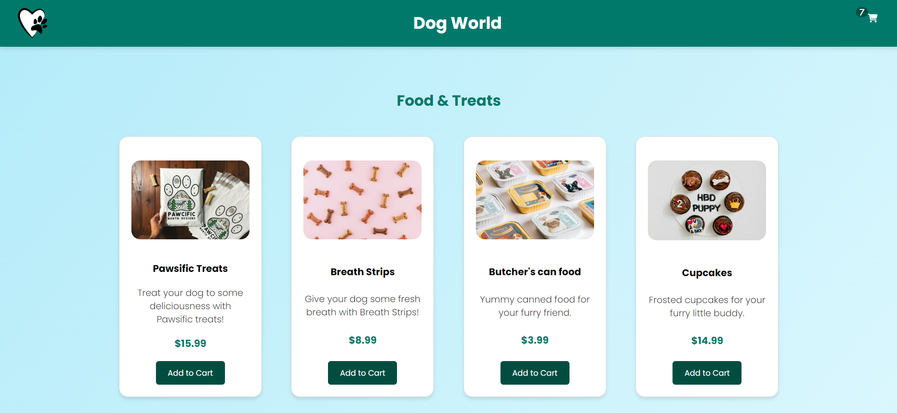
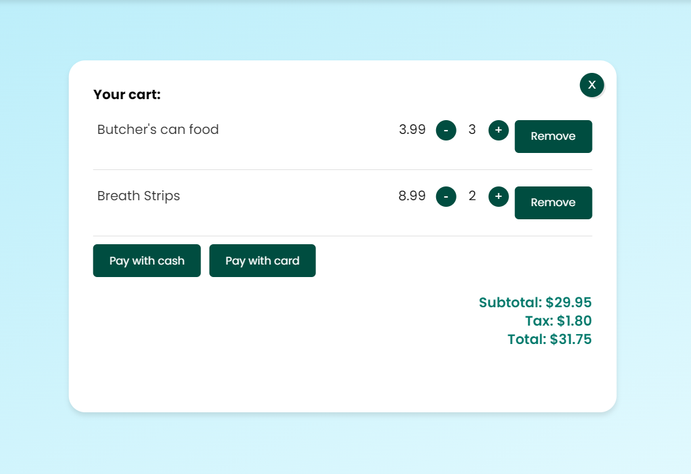
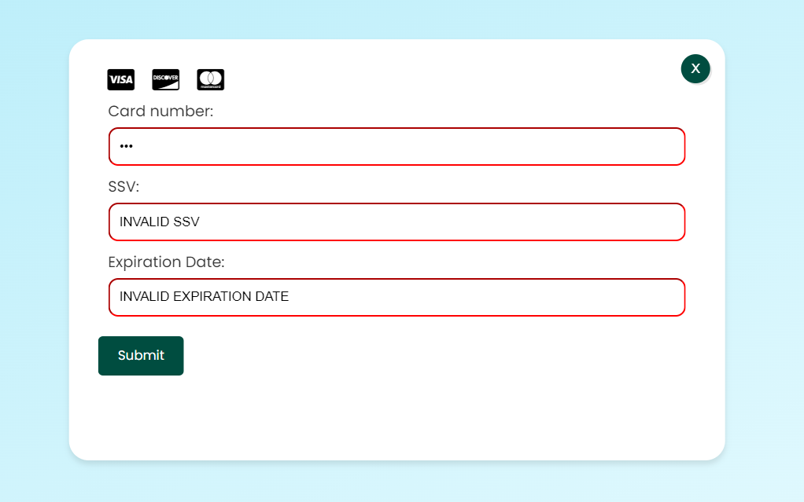
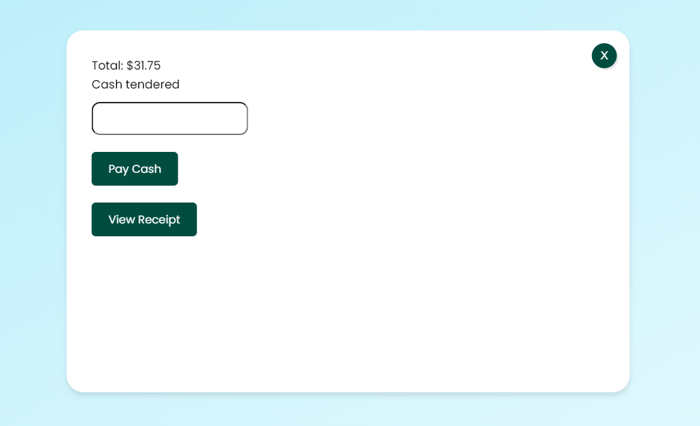

# Dog Shop POS System

Welcome to the Dog Shop POS System! This application is designed to streamline the sales process in a dog shop, where you can sell dog clothes, treats, and other accessories. The system includes functionalities such as adding and removing items from a cart and processing payments via card or cash.

The website is deployed with Netlify. You can find it here: <a href="https://dog-world.netlify.app/">Dog World</a>

## Table of Contents

- [Features](#features)
- [Technologies Used](#technologies-used)
- [Screenshots](#screenshots)
- [Contributing](#contributing)

## Features

- Mobile-first, responsive
- Add items to the cart
- Shopping cart view with item management
- View total price of items in the cart
- Process payments via card or cash
- View the receipt of your purchase

## Technologies Used

- HTML
- CSS
- JavaScript (DOM Manipulation)

## Screenshots

### Home Page

_The home page displays a list of available products with options to add them to the cart._

### Cart View

_The cart view shows the selected items, their quantities, and the total price. Users can update quantities or remove items._

### Card Payment View

_The card payment view allows users to enter their card details to complete the transaction. We have used regex for card information validation. User can view the receipt._

### Cash Payment View

_The cash payment view provides an option for users to pay with cash, showing the amount due and the change to be returned. User can view the receipt._

## Contributing

<a href="https://github.com/tmcarron">Tyler Carron</a>
<a href="https://github.com/Yulia182">Yulia Hernandez</a>
